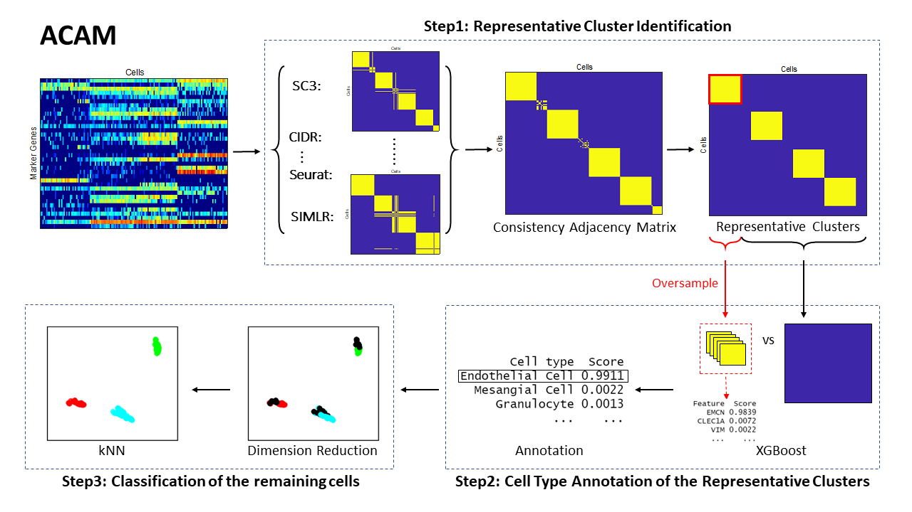

# ACAM

  

# Introduction
Automatic Cell type Annotation Method (`ACAM`) is proposed based on  marker genes'  information. This method first finds the representative clusters by searching for the  consistent subgroups across the  results  of  several popular clustering methods.  Such technique guarantees that the cells in the same cluster have very high probabilities of being from  the same cell type. Then by selecting the  features that  discriminate  one cluster from all the remaining cells,  the potential marker genes  are identified. The cell types are determined by defining a cell type importance score to match these marker genes with the validated ones.  For those cells that do not belong to any of these clusters, we use $k$-nearest neighbors to determine their cell type. 



# Installation
You can use our method `ACAM` by installing this R package with the following code.
```{r, eval = F}
devtools::install_github("yuc0824/ACAM")
```
# Basic Usage
`ACAM` requires the following inputs.
+ `DF` The cell-by-gene expression matrix with rows of cells and column of marker genes.
+ `gene.markers` The species- and tissue-specific marker genes obtained from CellMatch database. You can define your own markers.


We put Chen dataset in this package as the example.  

`DF_chen`: The dataset Chen obtained from GEO with the accession number: GSE99701. 

`GM_chen`: The species- and tissue-specific marker genes obtained from the database CellMatch. 

Before putting into ACAM, make sure that the dataset are log-normalized.
```{r, eval = F}
library(ACAM)
data("DF_chen")
data("GM_chen")
```
First, we get the clustering results from four of the five popular clustering methods with max pairwise ARI variances.
```{r, eval = F}
cluster_results <- ACAM_cluster(DF = DF_chen)
```

The dataset is then annotated by the function below.
```{r, eval = F}
annotation_results <-  ACAM_annotation(DF = DF_chen, cluster_results = cluster_results, gene.markers = GM_chen)
```


# Supplementary data
All the data, results and visualizations in the paper can be found at the repository <https://github.com/yuc0824/ACAMdata>.

# Authors
Yu Chen, Fudan University

Shuqin Zhang, Fudan University
